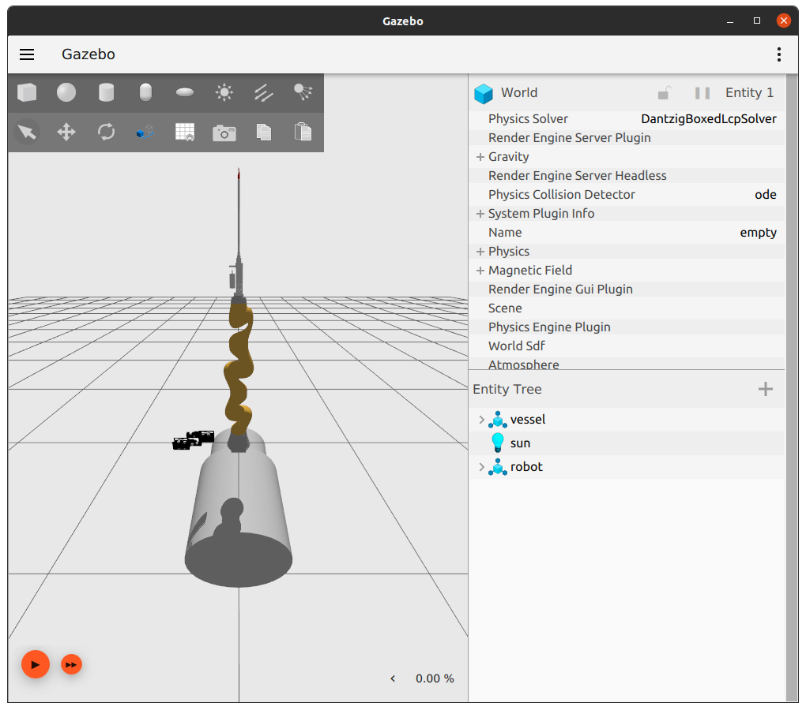
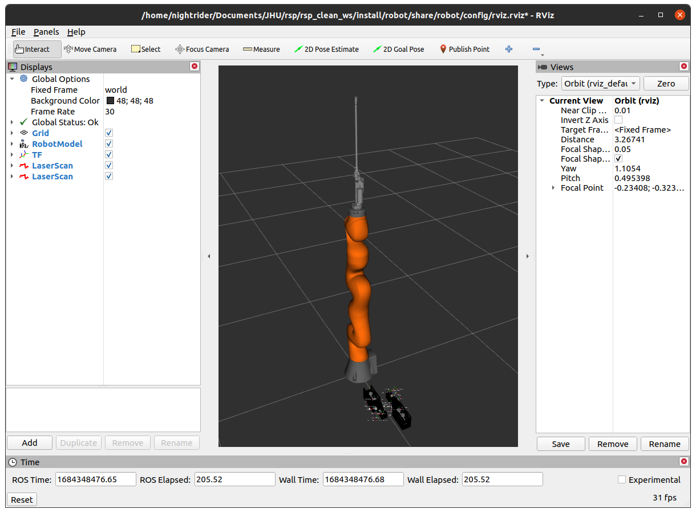

Installation
============

.. note::
  This project is under active development.

This tutorial goes over the installation process for the rsp-final-project.

Getting Started
---------------

Create a new workspace
----------------------

``mkdir -p <workspace_dir>/src``

Rename <workspace_dir> with the name of your choosing. 

Enter into the workspace.

``cd <workspace_dir>/src``

Clone the git repo
------------------

``git clone  https://github.com/jdcast/rsp-final-project.git``

Add the required repos and install dependencies.

``vcs import --recursive < rsp-final-project/galactic.repos``

``cd ..``

``rosdep -v install --from-paths src/rsp-final-project/ -y --ignore-src --skip-key="orocos_toolchain orocos_kdl rtt_ros2_services rtt_ros2_sensor_msgs rtt_ros2_std_msgs rtt_ros2_geometry_msgs rtt_ros2_topics rtt_ros2_params rtt_ros2_node rtt_ros2 kdl_typekit reflexxestype2 robot_joint_publisher_gui"``

Build orocos_toolchian
----------------------

``colcon build --packages-select orocos_toolchain``
``source install/setup.bash``

Install other dependencies
--------------------------

``sudo apt install ros-galactic-moveit-common && sudo apt install ros-galactic-moveit && sudo apt install ros-galactic-moveit-servo``

Build everything else 
---------------------

``colcon build --executor sequential``
``source install/setup.bash``

Alias to set environment variable
---------------------------------

There are quite a few RTT packages and there is a high chance of running into limitation, setting the below alias in the ``.bashrc`` file will help.
     
``alias rsp_rtt='export RTT_COMPONENT_PATH=$COLCON_PREFIX_PATH/kdl_typekit/lib/orocos:
$COLCON_PREFIX_PATH/orocos_toolchain/lib/orocos:
$COLCON_PREFIX_PATH/rtt_ros2_builtin_interfaces/lib/orocos:
$COLCON_PREFIX_PATH/rtt_ros2_geometry_msgs/lib/orocos:
$COLCON_PREFIX_PATH/rtt_ros2_interfaces/lib/orocos:
$COLCON_PREFIX_PATH/rtt_ros2/lib/orocos:$COLCON_PREFIX_PATH/rtt_ros2_node/lib/orocos:
$COLCON_PREFIX_PATH/rtt_ros2_params/lib/orocos:
$COLCON_PREFIX_PATH/rtt_ros2_primitives_typekit/lib/orocos:
$COLCON_PREFIX_PATH/rtt_ros2_rclcpp_typekit/lib/orocos:
$COLCON_PREFIX_PATH/rtt_ros2_std_msgs/lib/orocos:
$COLCON_PREFIX_PATH/rtt_ros2_topics/lib/orocos:
$COLCON_PREFIX_PATH/rsp_week07/lib/orocos:$COLCON_PREFIX_PATH/rtt_ur_trajectory/lib/orocos:
$COLCON_PREFIX_PATH/rtt_ros2_sensor_msgs/lib/orocos:
$COLCON_PREFIX_PATH/rtt_ros2_services/lib/orocos'``

Then run:

``rsp_rtt``

Launch the robot simulation 
---------------------------

You should see the robot in both an rivz and gazebo window.  See the images below for an example.

``ros2 launch robot robot.launch.xml``

.. list-table:: After: `ros2 launch robot robot.launch.xml` 
   :widths: 50 50
   :header-rows: 1

   * - gazebo
     - rviz
   * - |gazebo-1.png|
     - |rviz-1.png|

To see more details about a specific package, click on the links under Packages on the side!
