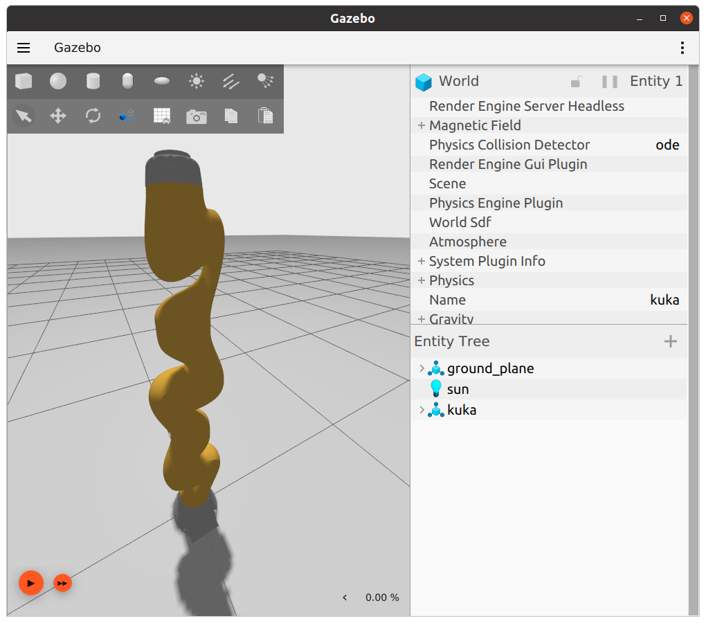
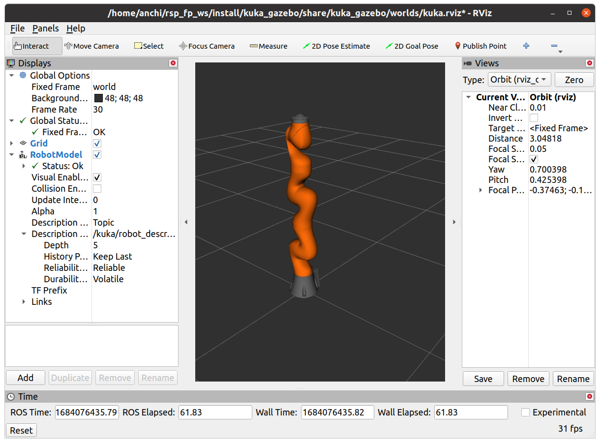
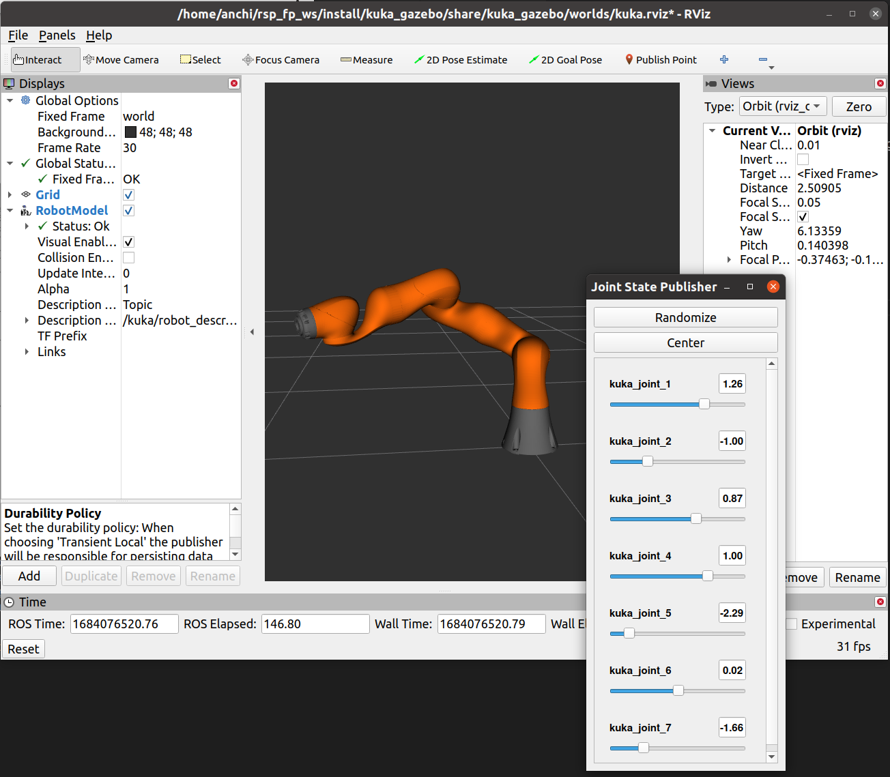

Kuka
=====

.. note::
  This page is under active development.

This package homes the details for the kuka robot used in this project. This package was originally set up to generate the KUKA description, gazebo, and control all together, but the workflow was switched to using the ``iiwa_ros2`` repo. The kuka_description and kuka_gazebo are kept within this package for legacy, but kuka_control is not based on these. Below we provide documentation for all of the packages.

Package Structure
------------------

* kuka_control

    * src
        contains source code for the executables built in this package

* kuka_description

    * launch

        contains launch file to start the `robot_state_publisher` and `joint_state_publisher` for the kuka.

    * meshes
    
        contains mesh files for the kuka robot.

    * urdf
        
        contains the URDF files for the kuka robot.

* kuka_gazebo

    * launch

        contains the launch file to start gazebo and rviz, adding the kuka.

    * worlds

        contains world file for gazebo and the rviz config file.

Running the Kuka (using iiwa_ros2 repository)
----------------

We have forked the `iiwa_ros2 <https://github.com/ICube-Robotics/iiwa_ros2.git>`_ repository, made some additions, and created a pull request.
The original repository only contains support for the IIWA14 robot, with simulation only in Gazebo Classic. The content from the original repository was kept the same, but we made the adddition of supporting the IIWA7 robot, as well as simulation in Ignition Gazebo. Along the way, we have had a lot of difficulties with the integration of ROS2 control into ignition gazebo, and the integration package `gz_ros2_control <https://github.com/ros-controls/gz_ros2_control.git>`_ seems to have some errors. We successfully started the ROS2 controller manager from the Ignition Gazebo environment through the plugin from gz_ros2_control, and also successfully loaded all the controllers. The controller manager exits as a node in ROS, and the relevant controller interfaces are present. However, calling the interfaces does not seem to produce an effect. As a replacement, we are launching the controller manager from the ROS environment and instead of using Gazebo for simulation, we use Rviz for visualization of the robot configuration. To run the package, follow these instructions (these assume starting the IIWA7 robot):

#. Build the packages ``colcon build``. Note that the packages from our forked iiwa_ros2 should also be built at this point.
#. ``source install/setup.bash``
#. Bring up the IIWA7 robot (run one of the following)
    * To launch the Rviz visualization, run ``ros2 launch iiwa_bringup iiwa7.launch.py``
    * To launch the Ignition Gazebo simulation, run ``ros2 launch iiwa_bringup iiwa_ignition.launch.py``. Note that if you opt for this step, the following commands might not produce a result. In addition, we've been having issues with running this on different systems, so if you get an error when launching this, you might want to do a fresh install of the gz_ros2_control repository (galactic branch) and then run ``export IGNITION_VERSION=fortress`` before ``colcon build``.
#. To get the current configuration of the robot, run ``ros2 run kuka_control getJ``. This would print the current joint configuration on the terminal.
#. To command the robot to a new configuration, run ``ros2 run kuka_control moveJ <j1> <j2> ... <j7>``. Note that this function takes at least seven arguments and will discard the rest.

Running the Kuka (description and gazebo within this package)
----------------

Again, this is kept for legacy, and does not work with the kuka_control package. However, the robot package does depend on it for integration with the suture tool. The robot package will be updated in the future to depend on the iiwa_ros2 packages instead.

#. Build the packages ``colcon build``
#. ``source install/setup.bash``
#. Launch rviz and gazebo with the kuka ``ros2 launch kuka_gazebo kuka_gazebo.launch.xml``

See below for example output.

.. list-table:: After: `ros2 launch kuka_gazebo kuka_gazebo.launch.xml` 
   :widths: 50 50
   :header-rows: 1

   * - gazebo
     - rviz
   * - |kuka_gazebo.png|
     - |kuka_rviz.png|

It is possible to move the kuka joints using the `Joint State Publisher` gui.

|kuka_joint_state.png|

