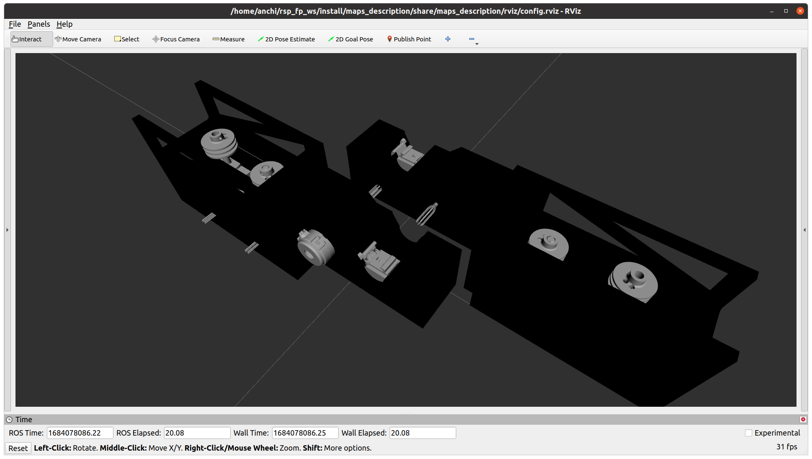
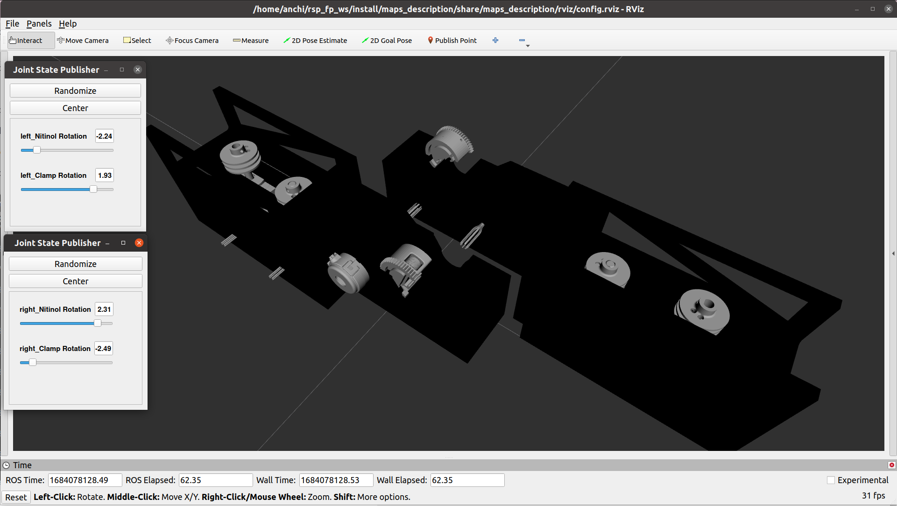
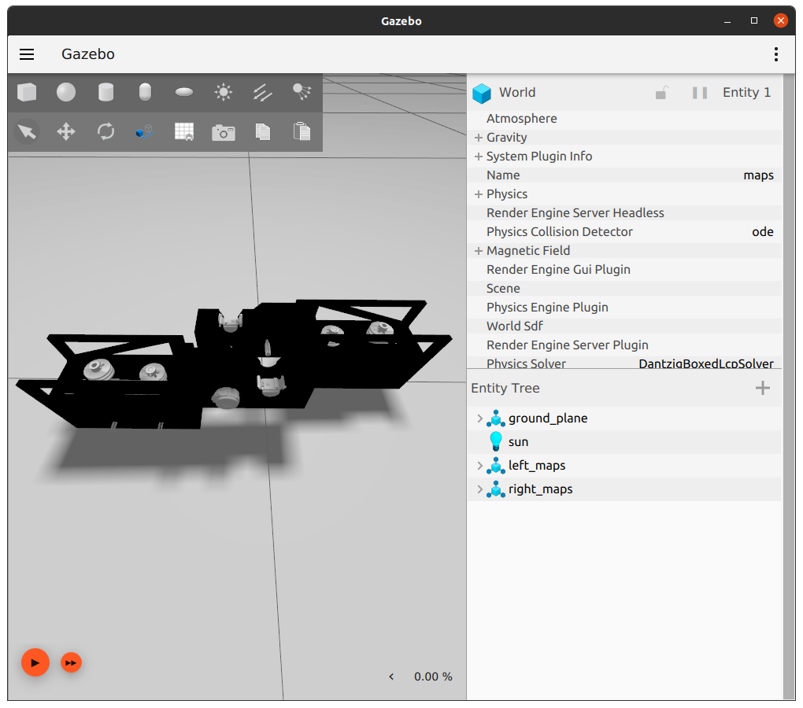

Maps
====

.. note::
  This page is under active development.

This package homes the details for maps.

Package Structure
------------------

* maps_control

    (*future work*) will contain the control files for the maps.

* maps_description

    * launch

        `maps_bringup.launch`: contains launch file to start the `robot_state_publisher` for the maps.

        `maps_double.launch`: launches full maps system.

        `maps_double.launch`: launch half maps system.

    * meshes
    
        contains mesh files for the maps components.

    * urdf
        
        contains the URDF files for the maps system.

    * rviz
         
        contains the rviz config file.

* maps_gazebo

    * launch

        contains the launch file to start gazebo and rviz, adding the maps system.

        `maps_double_gazebo.launch.xml`: launches the full maps system.

        `maps_single_gazebo.launch.xml`: launches half the maps system.

    * worlds

        contains world file for gazebo.

Running the Maps System
-----------------------

1. Build the packages ``colcon build``
2. ``source install/setup.bash``
3. Launch rviz with the maps system ``ros2 launch maps_gazebo maps_double_gazebo.launch.xml``

See below for example output.

Rviz window after: `ros2 launch maps_gazebo maps_double_gazebo.launch.xml` 

|maps_rviz.png|

Gazebo window after: `ros2 launch maps_gazebo maps_double_gazebo.launch.xml` 

|maps_gazebo.png|

It is possible to move the maps joints using the `Joint State Publisher` gui.

|maps_joints.png|

