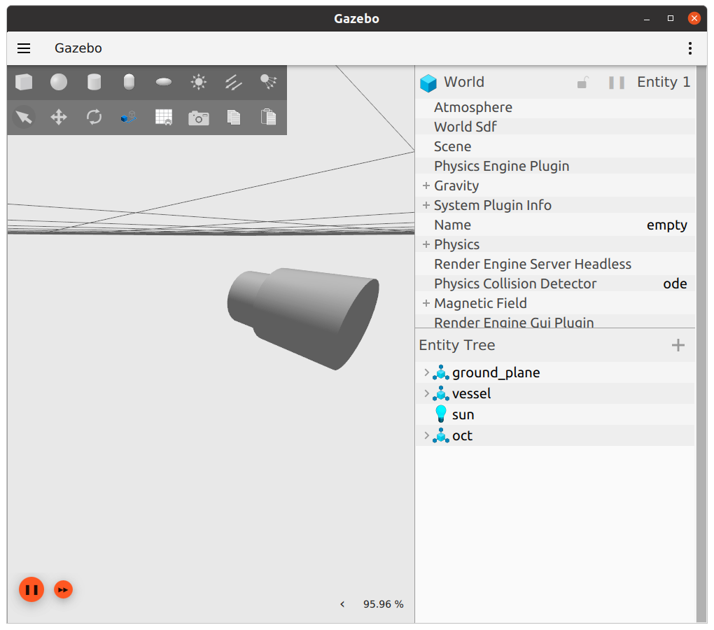

OCT
===

.. note::
  This page is under active development.

.. |oct_rviz.png| image:: ../_static/images/oct/oct_rviz.png
  :width: 100%
  :alt: rviz after ros2 launch oct_gazebo oct.launch.xml

This package homes the details for the OCT system. This package simulates an OCT imaging system of a blood vessel by using two lidar sensors.

Package Structure
------------------

* oct_description

  * config

    contains the rviz config file. 

  * launch

    contains the launch file to start the `robot_state_publisher` for the OCT system.

  * meshes

    contains the mesh files required for the OCT packages.

  * urdf

    contains the URDF files for the OCT system.

* oct_gazebo

    * config

      contains the the rviz config file.

    * launch
    
      contains the launch file to start gazebo and rviz, adding the oct system.

    * worlds
        
      contains the world files for gazebo.

* oct_plugin

  contains the gazebo plugin files for OCT sensor

Running the OCT
----------------

1. Build the packages ``colcon build``
2. ``source install/setup.bash``
3. Launch rviz and gazebo with the suture tool ``ros2 launch oct_gazebo oct.launch.xml``
4. In rviz, change the fixed frame from *world* to *oct_link*

You should see the sensor output in rviz.  The vessel in gazebo represents the blood vessel.  Each lidar sensor responds to a different part of the vessel - one lidar responds to the smaller cylinder *only*, while the other response to the larger cylinder *only*.
The size of the "vessel" is large simply for demonstration purposes.
This is accomplished by using the `visibility_mask` available on `lidar sensors <http://sdformat.org/spec?ver=1.9&elem=sensor#camera_visibility_mask>`_ in conjunction with the `visibility_flags` available on sdf models with `visual elements <http://sdformat.org/spec?ver=1.9&elem=visual#visual_visibility_flags>`_.
Lidar sensors derive from camera sensors and therefore have a `visbility_maks` even though it is not mentioned in the documentation.
The `visibility_mask` will be bit-wise AND with each `visual` element's `visibility_flags`. 
If the AND returns nonzero, then the visual is visible to the lidar sensor.
For this project, the `visibility_flags` are set for `tissue visual here <https://github.com/jdcast/microvascular-anastamosis/blob/d8e9b6b55ff6d3c344824faeb917703f303317f8/robot/worlds/world.sdf#L106>`_ and `nitinol visual here <https://github.com/jdcast/microvascular-anastamosis/blob/d8e9b6b55ff6d3c344824faeb917703f303317f8/robot/worlds/world.sdf#L156>`_. 
The `visibility_masks` are set for `tissue lidar sensor here <https://github.com/jdcast/microvascular-anastamosis/blob/d8e9b6b55ff6d3c344824faeb917703f303317f8/oct/oct_description/urdf/oct.xacro#L78>`_ and `nitinol lidar sensor here <https://github.com/jdcast/microvascular-anastamosis/blob/d8e9b6b55ff6d3c344824faeb917703f303317f8/oct/oct_description/urdf/oct.xacro#L109>`_.

NOTE: it is currently not known how close in proximity the camera and sensor can be. This would be helpful to ascertain so as to determine if this method is suitable long-term for simulating the nitinol/tissue proximity to the OCT sensor.

The below shows an example output.

NOTE: the OCT in gazebo is very small, so you'll need to zoom in above the "vessel" cylinders to see it.

If the "vessel" is moved along its z-axis in Gazebo, there will be either a set of red or blue laser scans in rviz below the OCT sensor (or both if its centered under the OCT sensor since the cylinders composing the "vessel" overlap some at the middle of the vessel).
The laser scans in rviz are rendered from the data streamed on the `oct_tissue` and `oct_nitinol` ROS topics.

.. list-table:: After: `ros2 launch oct_gazebo oct.launch.xml` 
   :widths: 50 50
   :header-rows: 1

   * - gazebo (showing simulates blood vessel)
     - rviz
   * - |oct_gazebo.png|
     - |oct_rviz.png|

