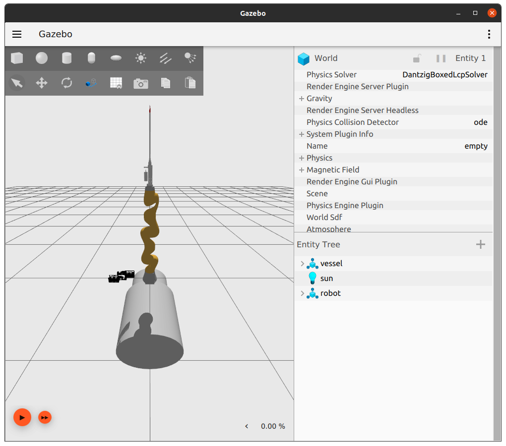
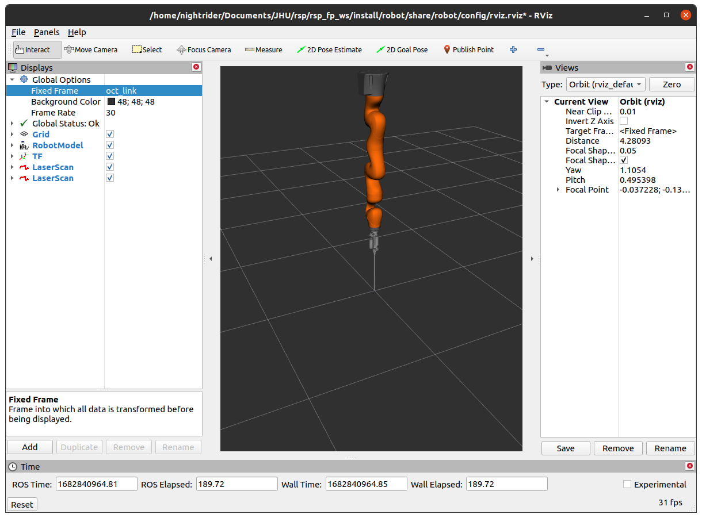

Robot
=====

.. note::
  This page is under active development.

This package homes the details for the complete microvascular-anastamosis system - comprised of the suture tool, kuka, maps and oct systems. To run just this combined system switch to the ``main`` branch in your workspace using ``git checkout --track origin/main``.

Run Example
-----------

.. |rviz-1.png| image:: ../_static/images/robot/rviz-1.png
  :width: 100%
  :alt: rviz after ros2 launch robot robot.launch.xml

1. ``ros2 launch robot robot.launch.xml``
2. In rviz, change fixed frame to `oct_link`
3. In gazebo, move model `vessel` over tool-tip.
   LaserScans will display in rviz in two different colors that represent each lidar sensor composing the OCT sensor, respectively.
   Each lidar sensor responds to a different part of the `vessel` i.e. one lidar responds to the smaller cylinder only while the other responds to only the larger cylinder.

See below output images.

.. list-table:: After: `ros2 launch robot robot.launch.xml` 
   :widths: 50 50
   :header-rows: 1

   * - gazebo
     - rviz
   * - |gazebo-1.png|
     - |rviz-1.png|

.. list-table:: After changing fixed in rviz to: oct_link 
   :widths: 50 50
   :header-rows: 1

   * - gazebo
     - rviz
   * - |gazebo-2.png|
     - |rviz-2.png|

.. list-table:: After pressing play in gazebo and moving vessel in gazebo. Note when only one lidar component of the OCT sensor is visible at a time in rviz.
   :widths: 33 33 33
   :header-rows: 1

   * - Vessel Left 
     - Vessel Middle
     - Vessel Right
   * - |run-1.png|
     - |run-2.png|
     - |run-3.png|
