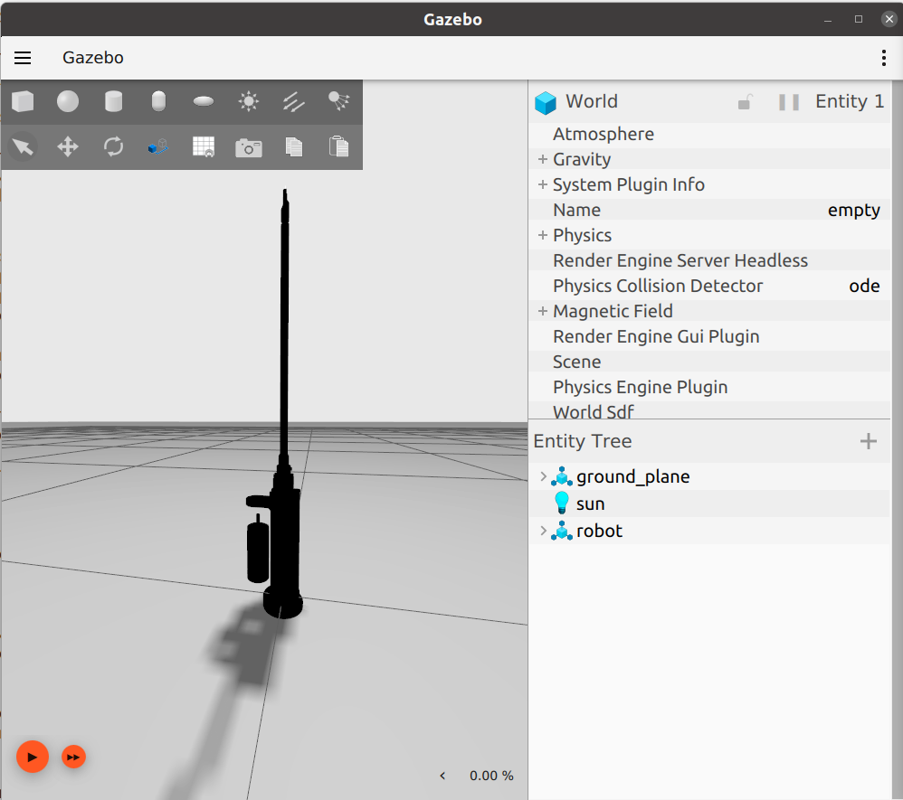
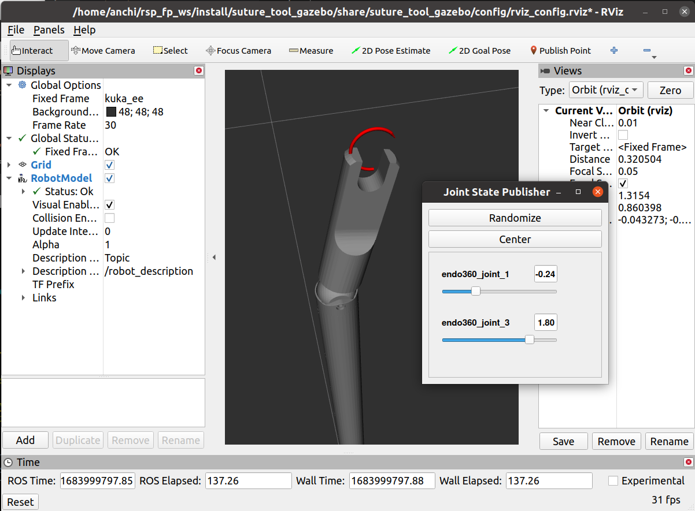

Suture Tool
===========

.. note::
  This page is under active development.

This package homes the details for the suturing tool - endo360 for this project.

Package Structure
------------------

* suture_tool_control

    (*future work*) will contain the control files for the suture tool.

* suture_tool_description

    * launch

        contains launch file to start the `robot_state_publisher` and `joint_state_publisher` for the suture tool.

    * meshes
    
        contains mesh files for endo360 tool and circular needle.

    * urdf
        
        contains the URDF files for the suture tool (endo360).

* suture_tool_gazebo

    * config

        contains the rviz config file.

    * launch

        contains the launch file to start gazebo and rviz, adding the suture tool.

    * worlds

        contains world file for gazebo.

Running the Suture Tool
------------------------

1. Build the packages ``colcon build``
2. ``source install/setup.bash``
3. Launch rviz and gazebo with the suture tool ``ros2 launch suture_tool_gazebo suture_tool.launch.xml``

See below for example output.

.. list-table:: After: `ros2 launch suture_tool_gazebo suture_tool.launch.xml` 
   :widths: 50 50
   :header-rows: 1

   * - gazebo
     - rviz (with the Joint State Publisher gui)
   * - |suture-tool_gazebo.png|
     - |suture-tool_rviz.png|

It is possible to move the suture joints using the `Joint State Publisher` gui.

|tool_joints.png|

